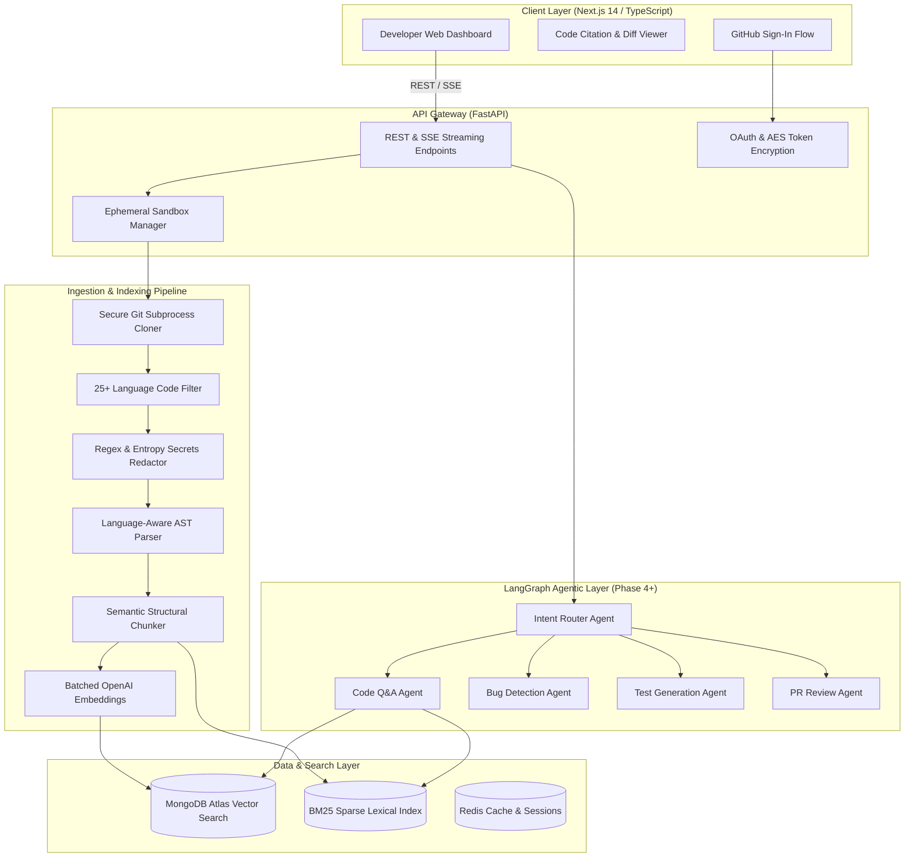

# DevMind — AI Engineering Copilot

[](https://opensource.org/licenses/Apache-2.0)
[](https://www.python.org/)
[](https://fastapi.tiangolo.com/)
[](https://nextjs.org/)
[](https://www.mongodb.com/products/platform/atlas-vector-search)
[](https://langchain-ai.github.io/langgraph/)

**DevMind** is an enterprise-grade AI Engineering Copilot designed to help software teams understand, navigate, secure, and improve large codebases. Unlike generic chatbots, DevMind connects directly to GitHub repositories, parses code into syntax-aware AST chunks, indexes them into MongoDB Atlas Vector Search, and orchestrates specialized multi-agent workflows to deliver precise answers with exact source code citations.

---

## 🌟 Key Capabilities

* **Grounded Code Q&A with Exact Citations:** Ask natural language questions about your repository (e.g., *"How is OAuth authentication implemented?"*) and receive accurate explanations citing exact file paths and line ranges (`auth.py:45-52`).
* **Language-Aware AST Parsing:** Preserves syntax boundaries for functions, classes, interfaces, and methods across Python, TypeScript/JavaScript, Go, and Java—avoiding broken function chunks.
* **Hybrid Vector & Lexical Search:** Unifies dense OpenAI embeddings (`text-embedding-3-small`, 1536 dims) with BM25 Okapi sparse keyword matching using $\alpha$-weighted reciprocal rank fusion.
* **Pre-Ingestion Secrets Redaction:** Scans source code using regex patterns and Shannon information entropy ($H > 4.5$) to detect and redact AWS credentials, GitHub PATs, OpenAI keys, Slack tokens, and private keys before vector indexing.
* **Sandboxed Ephemeral Ingestion:** Clones repositories into isolated temporary scratch directories with path-traversal guards, storage quotas, and token-masked URLs.
* **Deterministic SAST & Security Review (Upcoming Phase 5):** Pairs Bandit, ESLint, and Semgrep diagnostics with LLM reasoning to identify vulnerabilities while eliminating false positives.
* **Automated Test & PR Automation (Upcoming Phases 6–7):** Generates pytest/Jest unit tests and drafts auto-fix pull requests under strict human approval gates.

---

## 🏗️ System Architecture



---

## 📂 Project Structure

```text
├── backend/
│   ├── app/
│   │   ├── api/
│   │   │   ├── deps.py               # Shared auth & security dependencies
│   │   │   └── v1/
│   │   │       ├── endpoints/
│   │   │       │   ├── auth.py       # GitHub OAuth routes (/login, /callback, /me)
│   │   │       │   ├── repos.py      # Clone, scan, audit-secrets, index, search
│   │   │       │   └── git_ops.py    # Git commits, branch diffs, tags
│   │   │       └── router.py         # Consolidated v1 API router
│   │   ├── core/
│   │   │   ├── config.py             # Pydantic v2 typed settings validation
│   │   │   ├── database.py           # Async Motor / MongoDB connection manager
│   │   │   └── security.py           # Fernet AES-256 encryption & JWT lifecycle
│   │   ├── schemas/                  # Pydantic data transfer models
│   │   ├── services/
│   │   │   ├── ast_parser.py         # Language-aware AST parser (Py, TS, Go, Java)
│   │   │   ├── embedding_service.py  # Batched OpenAI embeddings with rate limiters
│   │   │   ├── file_filter.py        # Whitelist code filter & binary/noise pruner
│   │   │   ├── git_cloner.py         # Subprocess Git cloner with token masking
│   │   │   ├── git_metadata.py       # Commit logs & unified patch parser
│   │   │   ├── hybrid_retriever.py   # BM25 + Vector k-NN reciprocal rank fusion
│   │   │   ├── sandbox_manager.py    # Ephemeral UUID directories & quota guards
│   │   │   ├── secrets_sanitizer.py  # Regex & Shannon entropy credential redactor
│   │   │   └── semantic_chunker.py   # Boundary-preserving code block splitter
│   │   └── main.py                   # FastAPI application initialization & CORS
│   ├── pyproject.toml                # Python package metadata
│   ├── requirements.txt              # Backend dependencies
│   ├── ruff.toml                     # Ruff linter & formatter configuration
│   └── tests/                        # Comprehensive test suite (pytest)
├── frontend/
│   ├── src/
│   │   ├── app/
│   │   │   ├── layout.tsx            # Next.js App Router root layout
│   │   │   ├── page.tsx              # Developer copilot portal UI
│   │   │   └── globals.css           # Tailwind CSS directives & color variables
│   │   └── lib/                      # Frontend utilities
│   ├── package.json                  # Next.js & React dependencies
│   ├── tailwind.config.ts            # Tailwind CSS styling configuration
│   └── tsconfig.json                 # TypeScript compiler configuration
├── docker/
│   └── mongo-init.js                 # MongoDB database & indexes bootstrap script
├── docker-compose.yml                 # Local MongoDB Atlas & Redis containers
├── .env.example                       # Complete environment configuration template
├── .pre-commit-config.yaml            # Pre-commit hooks configuration
├── LICENSE                            # Apache 2.0 Open Source License
└── README.md                          # Project documentation
```

---

## 🚦 Implementation Roadmap

| Phase | Milestone Focus | Status |
| :---: | :--- | :---: |
| **Phase 1** | **Monorepo Architecture, Local Infra & GitHub OAuth** | ✅ Complete |
| **Phase 2** | **Sandboxed Git Ingestion, File Filtering & Secrets Redaction** | ✅ Complete |
| **Phase 3** | **AST Parsing, Semantic Chunking & MongoDB Atlas Hybrid Search** | ✅ Complete |
| **Phase 4** | **LangGraph Agent Core, Intent Router & Code Q&A Subagent** | ⏳ Next |
| **Phase 5** | **Hybrid Static Analysis (Bandit / ESLint / Semgrep) & Bug Hunter** | ⏳ Planned |
| **Phase 6** | **Automated Unit Test & Living Architecture Documentation Synthesis** | ⏳ Planned |
| **Phase 7** | **GitHub PR Diff Review & Human-in-the-Loop Auto-Fixing** | ⏳ Planned |
| **Phase 8** | **Interactive Next.js Portal with Citation Previews & Live Monaco Diff** | ⏳ Planned |
| **Phase 9** | **LangSmith Full-Stack Tracing, Prometheus Metrics & Token Quotas** | ⏳ Planned |
| **Phase 10** | **RAG Golden Evaluation Suite, Hardening & CI/CD Deployment** | ⏳ Planned |

---

## 🚀 Quick Start Guide

### 1. Prerequisites
* **Python**: 3.11 or newer
* **Node.js**: 20.x or newer
* **Docker & Docker Compose**: (Optional, for local MongoDB & Redis)

### 2. Configure Environment
Copy the configuration template:
```bash
cp .env.example .env
```
Fill in your credentials as needed (e.g. `OPENAI_API_KEY`, `GITHUB_CLIENT_ID`, `GITHUB_CLIENT_SECRET`).

### 3. Spin Up Local Services (Optional)
Start local MongoDB Atlas and Redis instances:
```bash
docker compose up -d
```

### 4. Run Backend API
```bash
cd backend
python -m venv .venv

# On Windows:
.venv\Scripts\activate
# On Linux/macOS:
source .venv/bin/activate

pip install -r requirements.txt
uvicorn app.main:app --reload --port 8000
```
Interactive OpenAPI documentation will be accessible at:  
👉 **[http://localhost:8000/docs](http://localhost:8000/docs)**

### 5. Run Frontend Web Portal
In a separate terminal:
```bash
cd frontend
npm install
npm run dev
```
DevMind Web UI will be accessible at:  
👉 **[http://localhost:3000](http://localhost:3000)**

---

## 📡 Live API Reference

### Authentication
* `GET /api/v1/auth/login`: Generates GitHub OAuth authorization URL.
* `POST /api/v1/auth/callback`: Exchanges OAuth code for credentials, encrypts PAT at rest, and issues a session JWT.
* `GET /api/v1/auth/me`: Returns current authenticated user profile.

### Repository Ingestion & Sandboxing
* `POST /api/v1/repos/clone`: Ingests repository into an ephemeral sandbox directory with shallow checkout and disk quotas.
* `GET /api/v1/repos/{repo_id}/scan`: Inventories eligible source files, line counts, and file sizes.
* `POST /api/v1/repos/{repo_id}/audit-secrets`: Detects credentials (AWS, OpenAI, GitHub, passwords) with optional in-place masking (`?redact_in_place=true`).
* `POST /api/v1/repos/{repo_id}/index`: Runs end-to-end AST parsing, semantic chunking, batched embeddings, and MongoDB vector indexing.
* `POST /api/v1/repos/{repo_id}/search`: Performs hybrid BM25 + dense vector code retrieval with line citations.
* `DELETE /api/v1/repos/{repo_id}/sandbox`: Purges temporary checkout storage.

### Git Metadata
* `GET /api/v1/git/{repo_id}/commits`: Returns chronological commit logs with authors, hashes, and messages.
* `GET /api/v1/git/{repo_id}/diff`: Computes unified diffs with line additions/deletions between any two Git references.
* `GET /api/v1/git/{repo_id}/tags`: Lists release tags and annotated release notes.

---

## 🧪 Testing

Run backend test suites:
```bash
cd backend
pytest -v
```

Run linting checks:
```bash
# Backend lint & format
cd backend
ruff check . --config ruff.toml
ruff format --check . --config ruff.toml

# Frontend lint
cd frontend
npm run lint
```

---

## 📄 License

This project is licensed under the **Apache License 2.0** — see the [LICENSE](LICENSE) file for details.
